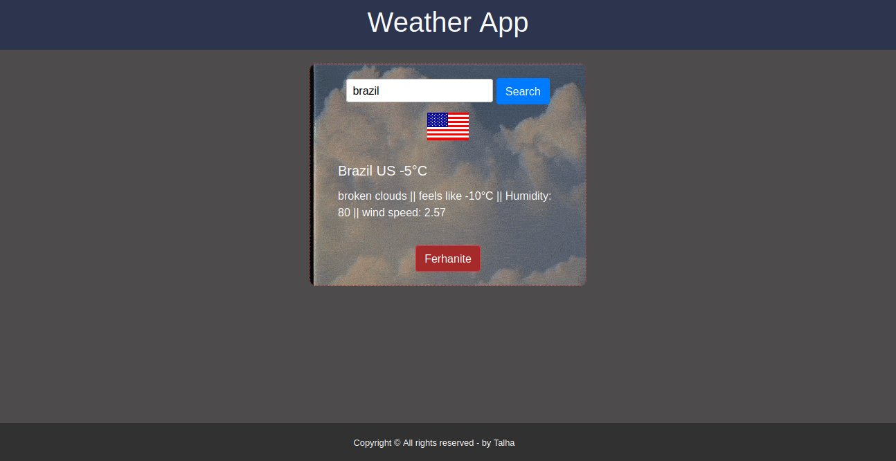

# Weather-App

This project is a weather forcast site build using javascript. It fetches weather info from www.openweathermap.org api and displayed it on app.

## Screen-shots:

## Live Demo

[Live Demo Link](https://rawcdn.githack.com/talhawaqar/Weather-App/054344312795249ad81f25ce9ece91dbe05c4ff2/dist/index.html)

## Build-With

- HTML5
- CSS3
- JavaScript Webpack
- VScode

## Getting Started

### Prerequisites

To get this project up and running locally, "npm install" is needed to be run in order to include all dependencies used for this project.

**To get this project set up on your local machine, follow these simple steps:**

1. Open Terminal.
2. Navigate to your desired location to download the contents of this repository.
3. Copy and paste the following code into the Terminal: git clone
4. cd WEATEHER-APP
5. run command npm install
6. run command npm run dev
7. open http://localhost:8080/ in browser

## Author Details::

👤 **Muhammad Talha Waqar**

- Github: [@TalhaWaqar](https://github.com/talhawaqar)
- Linkedin: [@TalhaWaqar](https://www.linkedin.com/in/talhawaqar/)
- E-mail: <a href="mailto:talhawaqar007@gmail.com?subject=Hello Talha!">Email</a>
- Twitter: [@TalhaWaqar](https://twitter.com/MuhammadTalhaW4)

## Show your support

Give ⭐ Star me on GitHub — it helps!

## 📝 License

This project is [MIT](lic.url) licensed.
